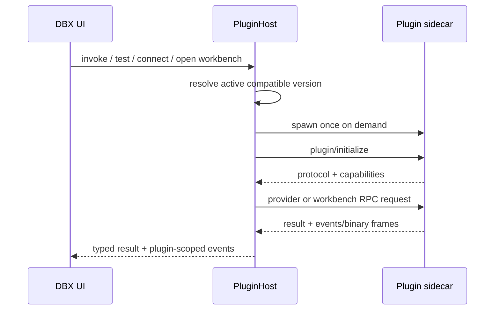

# DBX plugin platform

DBX plugins are optional, versioned `.dbxp` packages. They can add native backend behavior, sandboxed workbench UI, saved connection types, and filesystem providers without increasing the base DBX installation size. Declarative extension metadata consumed at build time lives here as well.

New plugin developers can read the official [Chinese documentation](https://dbxio.com/cn/docs/plugin-development) or [English documentation](https://dbxio.com/en/docs/plugin-development). The source files are also available as [Chinese MDX](../docs/content/docs/plugin-development.cn.mdx) and [English MDX](../docs/content/docs/plugin-development.mdx); the lower-level Chinese CLI walkthrough remains available in [`GETTING_STARTED.zh-CN.md`](./GETTING_STARTED.zh-CN.md).

Install the precompiled development CLI without cloning or compiling DBX:

```bash
npm install --global @dbx-app/plugin-cli
```

Marketplace listing pull requests go to `t8y2/dbx-store`. Plugin host, SDK, CLI, schema, documentation, and official-example changes go to `t8y2/dbx`. Ordinary plugin source stays in the plugin author's own repository.

The platform contract is manifest v1 + Host API 1.x + sidecar protocol v1. The source code for a plugin may live in this repository or in a separate repository; DBX installs only the built package.

## Repository layout

- `manifest.schema.json` — editor/CI schema for manifest v1.
- `marketplace.schema.json` — editor/CI schema for marketplace catalog v1.
- `sdk/rust/dbx-plugin-sdk` — Rust sidecar SDK.
- `sdk/go/dbx-plugin-sdk` — Go sidecar SDK.
- `sdk/cli` — Rust source for the `dbx-plugin create/package` CLI published as `@dbx-app/plugin-cli`.
- `sdk/packager` — deterministic `.dbxp` packager plus repository-side Ed25519 signing.
- `sdk/templates/github/plugin-release.yml` — caller template for multi-platform unsigned release candidates.
- `examples/hello-workbench` — complete connection provider + native sidecar + sandboxed workbench example.
- `RELEASING.md` — source ownership, release assets, official-store submission, and review workflow.
- `SIGNING.md` — repository-signing trust model, key rotation, and future author-attestation boundary.
- `connection-types/` — build-time registry for every DBX connection target, including databases, data services, message queues, and service registries.
- `dialects/` — SQL dialect descriptors, type catalogs, DDL templates, and metadata rules.
- `mappings/` — cross-dialect type mapping rules.
- `jdbc/` — legacy JDBC sidecar retained during migration to manifest v1; connects through vendor JDBC drivers and custom JDBC URLs.

Create a frontend-only universal plugin or a complete Rust/Go plugin project:

```bash
dbx-plugin create my-ui-plugin --template frontend
dbx-plugin create my-rust-plugin --template rust
dbx-plugin create my-go-plugin --template go
```

All generated projects include sandbox workbench UI, localized manifest metadata, `.dbxp` packaging configuration, and a GitHub Release workflow. Rust and Go templates additionally include a native sidecar and multi-platform build matrix; frontend-only projects publish one `universal` package.

## Source, package, and installation

These are separate artifacts:

1. **Source repository** — plugin authors build and test here or in another repository.
2. **`.dbxp` artifacts** — plugin CI publishes unsigned review candidates; the repository operator signs approved candidates and publishes the installable assets.
3. **Installed plugin** — DBX verifies and extracts the package under its plugin store.

Optional plugins are not bundled into the DBX base package. Installing SSH, SFTP, OpenDAL, or another future plugin increases only the local plugin store size.

## Marketplace and repository model

The Plugin Center separates three concerns:

- **Marketplace** aggregates enabled repositories, searches and filters catalog metadata, selects the current platform artifact, and installs or updates it.
- **Installed** manages the local plugin lifecycle and opens connection providers, workbenches, and filesystem providers.
- **Settings** manages local `.dbxp` installation, custom repositories, development-only unsigned packages, and advanced repository trust.

Repository configuration is persisted under the plugin store in `.repositories.json`. DBX always exposes one managed `dbx-official` repository backed by the official catalog:

```text
https://raw.githubusercontent.com/t8y2/dbx-store/main/catalog/index.json
```

The official URL is part of the DBX client contract and cannot be edited in Plugin Center settings. Official repository signing public keys are built into DBX; release builds may append rotation keys with `DBX_PLUGIN_MARKETPLACE_TRUSTED_KEYS_JSON`. Custom repositories use user-managed repository keys. The official repository accepts only DBX-managed keys, so adding a custom key cannot impersonate an official package.

Catalog v1 is defined by `marketplace.schema.json` and includes repository metadata, localized plugin metadata, searchable tags, permissions, versions, release notes, and target artifacts. Each artifact declares `signingKeyId`. DBX first selects the exact current target and then falls back to `universal`. Artifact URLs may be relative to the catalog URL. DBX enforces a 4 MiB catalog limit and a 512 MiB package limit, resolves only HTTP(S) URLs, limits redirects, isolates repository failures, verifies the catalog-declared size and SHA-256, then requires the package Manifest ID, version, publisher, permissions, and Ed25519 key ID to match the reviewed catalog before activation.

Run the live official-store smoke test with:

```bash
cargo run -p dbx-core --no-default-features --example plugin_marketplace_smoke
cargo run -p dbx-core --no-default-features --example plugin_marketplace_smoke -- <plugin-id> [version]
```

Without a plugin ID the smoke test verifies catalog availability and parsing. With a listed plugin ID it additionally downloads, verifies, installs, and reports the trusted signing key.

### Review and signatures have different jobs

- **Human review** decides whether a plugin is allowed into a curated catalog and whether `verified` may be shown.
- **Catalog SHA-256** proves that the downloaded release asset is the exact artifact selected by the reviewed catalog.
- **Ed25519 repository signing** proves that the installed package is exactly the artifact approved and published by that repository.
- **Runtime permissions and host boundaries** limit what the plugin UI can request after installation.

Review alone cannot protect an already approved download URL from later replacement. A signature alone does not mean the plugin is safe or reviewed; it only authenticates the signer and bytes.

### Recommended repository ownership

Keep the host, SDK, schemas, packager, and minimal examples in `t8y2/dbx`. The official catalog and review metadata live in the separate [`t8y2/dbx-store`](https://github.com/t8y2/dbx-store) repository:

```text
t8y2/dbx-store
├── plugins/              # reviewed metadata submissions
├── publishers/           # publisher identity and review records
├── revoked.json          # revoked versions or signing keys
├── catalog/index.json    # generated catalog v1
└── .github/workflows/    # schema, review, hash, and publish gates
```

Plugin source code may remain in independent author repositories. Author CI builds one unsigned `.dbxp` candidate per target and publishes it to GitHub Releases, a CDN, or object storage. The reusable release workflow emits `release-candidates.json` with Manifest identity plus verified candidate metadata. After review, the repository signing workflow signs the accepted bytes and publishes final artifacts and metadata; the catalog Git repository should not accumulate binary packages.

The same protocol supports future commercial deployment without changing package format: a public official repository, user-added third-party repositories, managed enterprise repositories with organization policy, and fully offline catalog/package mirrors. Credentials for private repositories must enter a secret-store-backed request layer rather than `.repositories.json`.

## Package layout

```text
example-1.0.0-darwin-arm64.dbxp
├── manifest.json
├── checksums.json
├── signature.json                 # required except explicit development installs
├── bin/
│   └── darwin-arm64/
│       └── example-plugin
├── assets/
│   ├── plugin.svg
│   └── connection.svg
└── ui/
    ├── index.html
    └── assets/...
```

`.dbxp` is a ZIP container with stricter rules:

- every file except `checksums.json` and `signature.json` must be covered exactly once by SHA-256 checksums;
- absolute paths, parent traversal, duplicate entries, symlinks, oversized entries, and decompression bombs are rejected;
- installed versions are immutable;
- activation records select the current version and support rollback;
- install, rollback, uninstall, and trust-store mutation share a filesystem lock;
- marketplace and normal local installs require a signature from a trusted Ed25519 repository key;
- unsigned packages require the explicit development-install toggle.

## Manifest v1

Add the schema to a manifest for editor validation:

```json
{
  "$schema": "../../manifest.schema.json",
  "manifest_version": 1,
  "id": "vendor.example",
  "name": "Example",
  "icon": "assets/plugin.svg",
  "version": "1.0.0",
  "source": "https://github.com/example/dbx-plugin",
  "homepage": "https://example.com/dbx-plugin",
  "engines": {
    "dbx": ">=0.5.68",
    "host_api": "^1.0"
  }
}
```

The runtime also validates semantic versions, engine ranges, IDs, contribution references, field types and bindings, entrypoint containment, current-platform binaries, and required backend/UI entrypoints. The JSON schema improves authoring but is not the security boundary.

### Entrypoints

```json
{
  "entrypoints": {
    "backend": {
      "executable": "bin/darwin-arm64/example"
    },
    "ui": {
      "root": "ui",
      "entry": "ui/index.html"
    }
  }
}
```

Use `stdio-jsonl` for ordinary request/event traffic. Use `stdio-framed` when PTY, SFTP, file transfer, or another feature needs binary channels. The workbench bridge transfers plugin-UI binary payloads as transferable `ArrayBuffer`s in both directions (8 MiB per message; chunk larger transfers), so UI-side binary traffic no longer pays a base64 round trip.

## Contributions

### `connection-provider`

A provider owns validation and connect/disconnect lifecycle for a saved non-SQL connection. DBX stores these as:

```text
ConnectionConfig
├── db_type: "plugin"
├── plugin_id
├── plugin_connection_provider
├── plugin_connection_type
├── common fields: name / host / port / username / password / database
├── external_config: provider-defined non-secret values
├── connection_secrets: provider-defined secrets
└── transport_layers: SSH jump / SOCKS / HTTP proxy
```

The provider-defined type, such as `ssh`, stays in `plugin_connection_type`; it does not extend DBX's exhaustive database enum.

Plugin authors may declare package-relative display metadata:

```json
{
  "name": "Example plugin",
  "icon": "assets/plugin.svg",
  "contributions": [
    {
      "type": "connection-provider",
      "id": "vendor.example.connection",
      "label": "Example connection",
      "icon": "assets/connection.svg"
    }
  ]
}
```

DBX resolves connection display metadata in this order: provider `label` / `icon`, plugin `name` / `icon`, then provider ID and the built-in generic plugin icon. Declared icon files must remain inside the plugin package and use SVG, PNG, JPEG, GIF, WebP, or ICO. SVG is rendered through an image URL rather than injected into the DBX document.

Field bindings:

| Binding                                                    | Storage                                                          |
| ---------------------------------------------------------- | ---------------------------------------------------------------- |
| `name`, `host`, `port`, `username`, `password`, `database` | matching common `ConnectionConfig` field                         |
| `config`                                                   | `external_config[field.key]`                                     |
| `secret`                                                   | `connection_secrets[field.key]`, persisted outside `config_json` |

Password fields default to `secret` when `binding` is omitted. DBX validates required values and value types before calling the plugin. The plugin receives the hydrated connection only in its backend lifecycle request; the workbench UI receives a connection ID and non-secret navigation context.

Absent optional fields stay absent: when DBX hands the manifest to its own UI it omits `description`, `placeholder`, `default`, and `binding` for fields that do not declare them, and `"default": null` means "no default" exactly like omitting the key. Treat a missing value as unset — never as an empty string, and never as the literal text `null`, which is not a storable plugin value.

#### Local file fields

A `text`, `password`, or `textarea` field may declare `picker` when the user should choose a local file (private keys, keystores, credential files):

```json
{
  "key": "private_key_path",
  "label": "Private key path",
  "type": "text",
  "binding": "config",
  "picker": { "kind": "file", "accept": [".pem", ".key", ".ppk"], "content_field": "private_key" }
}
```

- **Desktop hosts** open a native picker and store the chosen **absolute path** in the declaring field. The plugin backend runs on the same machine, so it can read the file itself.
- **Browser hosts** cannot resolve a path on the user's machine, so the same action becomes an **upload**: DBX reads the selected file and stores its **content** in `content_field` (which must be a declared `text` / `password` / `textarea` sibling), and clears the declaring field. A picker without `content_field` is therefore desktop-only and stays hidden in the browser.
- Switching source clears the other one: choosing a path removes the uploaded content and vice versa. This matters for fields that are alternatives — a plugin that prefers `private_key` content over `private_key_path` must not keep serving a stale upload after the user re-picked a path.
- `kind` is `file` (default use case) or `directory` (desktop-only: a browser cannot hand a folder to the plugin). `accept` lists up to 16 filters as extensions (`.pem`) or MIME types (`text/plain`) and is passed to the native dialog and the browser file input unchanged. Uploads are capped at 1 MiB.

`picker` is additive; hosts older than the release that ships it reject the manifest, so keep `engines.dbx` at or above that release when the form relies on it.

#### Conditional fields

A field may declare `visible_when` and `required_when`. A leaf clause matches when the referenced sibling field holds a non-empty value listed in `one_of`; listed values may be strings, numbers, or booleans and are compared by canonical string form, so `false` and `"false"` both match a boolean `false`. Clauses compose with `all_of`, `any_of`, and `not`:

```json
{
  "key": "sudo_command",
  "label": "Sudo command",
  "type": "text",
  "visible_when": {
    "all_of": [
      { "field": "sudo_source", "one_of": ["custom"] },
      { "field": "read_only", "one_of": [false] }
    ]
  },
  "required_when": {
    "all_of": [
      { "field": "sudo_source", "one_of": ["custom"] },
      { "not": { "field": "read_only", "one_of": [true] } }
    ]
  }
}
```

- `all_of` / `any_of` must contain at least one nested condition, nesting is limited to 8 levels and 64 nodes, and every referenced field must be a sibling declared by the same provider.
- Conditions cascade: while the field a clause reads is itself hidden, the clause does not count. A hidden container's stored default therefore cannot surface a grandchild field, and a hidden operand of `not` keeps the field dormant instead of lighting it up.
- DBX evaluates the same conditions for the dialog and for save/test/connect validation, so a manifest can never produce a form DBX itself rejects.
- Composite conditions were added after the single-clause contract; keep `engines.dbx` at or above the DBX release that ships them if the form relies on them.

Lifecycle methods receive:

```json
{
  "provider": { "id": "vendor.example.connection", "databaseType": "example" },
  "connection": { "id": "...", "db_type": "plugin", "...": "..." },
  "runtime": { "host": "127.0.0.1", "port": 49152 }
}
```

`runtime.host` and `runtime.port` are the final endpoint after DBX transport layers. A protocol plugin must connect to this endpoint instead of rebuilding DBX tunnels itself.

#### Connection dialog actions

Connection providers may add ordered custom actions before DBX-owned lifecycle buttons:

```json
{
  "actions": [
    {
      "id": "discover",
      "label": "Discover endpoint",
      "variant": "outline",
      "requires_valid_form": false
    }
  ]
}
```

- `actions` declares only custom button metadata. DBX invokes `connection/action` with the action ID; plugins cannot choose arbitrary RPC method names.
- `test`, `save`, and `save-and-connect` are host-owned actions. DBX adds them from provider capabilities and dialog mode, validates the form, persists secrets through its secret store, and invokes the fixed lifecycle methods.
- A custom action may run with an incomplete form only when `requires_valid_form` is `false`; DBX still validates declared field types, secret keys, and transport configuration.
- `when` accepts `always`, `create`, or `edit`. `variant` accepts `default`, `outline`, `secondary`, `destructive`, or `ghost`. `timeout_ms` is limited to 1-120000 ms.
- `close_on_success` controls whether the connection dialog closes after a successful custom action.

`connection/action` receives the normal provider lifecycle payload plus `action: { id }`. It may return a message and updates for declared fields:

```json
{
  "success": true,
  "message": "Endpoint discovered",
  "fieldValues": {
    "host": "db.internal",
    "port": 5432
  }
}
```

`fieldValues` may contain only fields declared by that provider and must match their declared types. `null` clears a field. The plugin cannot write arbitrary `ConnectionConfig` keys or bypass DBX-owned save, secret persistence, transport, and connection lifecycle logic.

### `workbench`

A workbench opens in a normal persistent DBX tab. The iframe is loaded with `sandbox="allow-scripts"`, a restrictive CSP, no Tauri object, no parent DOM access, and no direct network access. The host injects `window.dbxPlugin`:

- `ready` / `context` / `locale` — `locale` is the current DBX locale such as `en` or `zh-CN`
- `theme` — `{ appearance: "light" | "dark", tokens }` with the resolved DBX design tokens; theme changes are pushed live through env updates, and the SDK applies them to the plugin document root
- `onContext(listener)` — context changes are pushed live; the iframe is not reloaded, so plugin UI state survives navigation
- `invoke(method, params, options)`
- `notify(method, params)`
- `sendBinary(channel, data)` — requires `host.binary`
- `readAsset(path)` / `readAssetUrl(path)`
- `openWorkbench(contributionId, context)` — requires `host.workbench`
- `openFilesystem(providerId, context)` — requires `host.filesystem`
- `onEvent(listener)` — events are forwarded only with `host.events`
- `onBinary(listener)` — binary frames are forwarded only with `host.binary`; listeners receive `{ channel, data: Uint8Array }`

The sandbox default is no network access at all. A plugin may declare per-origin permissions such as `host.network:https://api.vendor.com` (https only, no path, at most 8 origins, duplicates rejected); declared origins — and only those — are added to the sandbox `connect-src`, so reviewers can see exactly which services the plugin UI may call.

All backend calls are rebound to the owning plugin ID by the host. A plugin UI cannot invoke another plugin.

### Official UI kit and theming

Every sandbox document ships with a small official component kit built on the DBX design tokens, so plugin UI follows light/dark mode and custom palettes automatically:

```html
<button class="dbx-btn dbx-btn--primary">Connect</button>
<input class="dbx-input" placeholder="Endpoint" />
<span class="dbx-badge">Ready</span>
```

Available classes: `dbx-card`, `dbx-section-title`, `dbx-btn` (`--primary` / `--danger` / `--ghost`), `dbx-label`, `dbx-input`, `dbx-select`, `dbx-textarea`, `dbx-hint`, `dbx-row` (label + field grid), `dbx-table`, `dbx-badge`, `dbx-link`. Custom plugin CSS can use the same `var(--color-*)` tokens; `document.documentElement.dataset.dbxTheme` reflects the current appearance.

Plugin-authored names, descriptions, contribution labels, form-field text, and select-option labels can be localized through `manifest.json > localizations`. DBX selects the exact current locale first, then its base language, and finally falls back to the manifest's default text:

```json
{
  "localizations": {
    "zh-CN": {
      "name": "示例插件",
      "contributions": {
        "vendor.example.connection": {
          "label": "示例连接",
          "fields": {
            "host": { "label": "主机", "placeholder": "请输入主机" },
            "mode": { "options": { "readonly": "只读" } }
          }
        }
      }
    }
  }
}
```

### `result-view`

A result view contributes a plugin-rendered visualization for query results. DBX shows one toolbar button per installed view next to the result grid; clicking it opens the plugin workbench with the current result as context:

```json
{
  "type": "result-view",
  "id": "vendor.example.graph",
  "label": "Graph"
}
```

The workbench `context.result` is a bounded snapshot — `{ columns, rows (<= 500), truncated }` plus `sql`, `connectionId`, and `database`. Plugins that need the full or streamed result set should re-execute through their backend using the SQL and connection reference. Requires a UI entrypoint.

### `context-menu`

A context-menu entry is rendered **natively** by DBX (no sandbox iframe, native theme and keyboard behavior) in the declared menu surface. v1 supports the saved-connection sidebar menu:

```json
{
  "type": "context-menu",
  "id": "vendor.example.inspect",
  "label": "Inspect endpoint",
  "menu": "connection"
}
```

Clicking the item dispatches a `contextMenu/<id>` backend request with a non-secret connection summary (`{ id, dbType, name, database }`). The backend entrypoint is required; return `{ "message": "..." }` to surface a toast.

### `filesystem-provider`

A filesystem provider declares URI schemes, an optional icon, `root_uri`, and capabilities (`read`, `write`, `delete`, `rename`, `mkdir`). It is the reusable boundary for OpenDAL-like storage integrations: DBX owns the generic file-browser tab, while the plugin owns authentication, remote API calls, and provider-specific state. The provider icon is used for the saved connection in the sidebar and for its DBX tab; it falls back to the plugin-level icon when omitted.

A connection provider can set `filesystem_provider` instead of `workbench`. Opening that saved connection connects the plugin lifecycle and opens the DBX host file manager. A provider may declare both: DBX opens the custom workbench by default, and the sandboxed UI can call `openFilesystem(providerId, context)` with `host.filesystem` permission.

```json
{
  "type": "filesystem-provider",
  "id": "vendor.storage.files",
  "label": "Object storage",
  "icon": "assets/filesystem.svg",
  "schemes": ["s3"],
  "root_uri": "s3://bucket/",
  "capabilities": ["read"]
}
```

Host API 1.x defines these backend methods:

- `filesystem/list` receives `providerId`, optional `connectionId`, `uri`, optional pagination `cursor`, and a bounded `limit`. It returns `{ entries, nextCursor? }`.
- `filesystem/read` receives `providerId`, optional `connectionId`, `uri`, and bounded `maxBytes`. It returns `{ dataBase64, contentType?, truncated, etag? }` for preview-sized reads.
- `filesystem/write` receives `providerId`, optional `connectionId`, `uri`, `dataBase64`, `create`, `overwrite`, and optional optimistic-concurrency `etag`.
- `filesystem/createDirectory` receives `providerId`, optional `connectionId`, and `uri`.
- `filesystem/delete` receives `providerId`, optional `connectionId`, `uri`, and `recursive`.
- `filesystem/rename` receives `providerId`, optional `connectionId`, `sourceUri`, `targetUri`, and `overwrite`.

Every entry has `name`, canonical `uri`, `kind` (`file`, `directory`, `symlink`, or `other`), and optional `size`, `modifiedAt`, and `contentType`. DBX validates schemes, response sizes, base64, cursors, and entry metadata before the frontend sees a result.

Mutation methods return `{ success, message?, entry? }` and are rejected unless the provider declares the matching capability. Inline read/write payloads are capped at 4 MiB. The built-in file manager currently owns directory navigation, pagination, and bounded file preview. Large upload/download and PTY/SFTP streams use `stdio-framed` binary channels with plugin-defined transfer methods, chunk acknowledgements, cancellation, and progress events; they must not be encoded as one large JSON value.

### Host API methods a plugin may call

Plugins normally answer requests, but Host API 1.1 adds one method a plugin backend may call back into DBX. Plugin-initiated requests use **string** ids (`"prompt-1"`), while DBX-owned requests and their responses keep numeric ids, so one stream carries both directions and older hosts that only understand numeric ids ignore the new frames instead of failing.

- `host/requestUserInput` asks the user a question through the DBX UI and returns the answer. It is the channel for anything the host cannot answer on the user's behalf: a bastion's keyboard-interactive MFA code, a one-time approval, a host-key confirmation, or a choice between accounts.

```json
{
  "jsonrpc": "2.0",
  "id": "prompt-1",
  "method": "host/requestUserInput",
  "params": {
    "prompt": "Verification code (6 digits)",
    "title": "JumpServer login",
    "echo": false,
    "default": "000000",
    "options": [{ "value": "jinpy", "label": "jinpy (admin)" }],
    "timeoutSecs": 300
  }
}
```

- `prompt` is required (≤2000 characters). `title` (≤200), `default` (≤1000), and `options` (≤8 entries, unique values, ≤200 characters each) are optional; `echo` defaults to `false`, so the dialog masks input unless the plugin says otherwise. `timeoutSecs` is clamped to 5-600 and defaults to 300.
- The result is `{ "action": "submit", "value": "123456" }`, `{ "action": "cancel" }`, or `{ "action": "timeout" }`. Only `submit` carries a value; treat `cancel` and `timeout` as "no answer" and fail closed — never fall back to a guess.
- The prompt is delivered through the same blocking dialog the host uses for its own host-key and keyboard-interactive prompts, so it also appears for `connection/test` and `connection/connect`. While a prompt is open DBX pauses the request deadline of the call that is waiting on it, so a user typing a code is never mistaken for a connect timeout.
- Errors come back as JSON-RPC errors: `-32001` means no user interface is attached (headless/MCP runs, or the desktop dialog is not mounted), `-32602` means the params are invalid, `-32601` means the host does not implement the method. A plugin must degrade gracefully on all three instead of blocking forever.
- DBX answers only with what the user typed. It never auto-fills, caches, or logs the value, and it allows at most four open prompts per plugin session.
- Capability gating: `plugin/initialize` advertises `host.hostApiVersion` (`1.1.0` or later) and `host.features` (containing `host.requestUserInput` when available). Only call the method when it is advertised; an older host reports `1.0.0` and drops the frame.
- The Rust SDK (`dbx-plugin-sdk`) wraps this: `dbx_plugin_sdk::host_client()`, `HostClient::supports("host/requestUserInput")`, and `HostClient::request_user_input(&UserInputPrompt::secret("Verification code"))`.

## Backend protocol

The backend is a persistent child process with stdin/stdout reserved for the DBX protocol. Diagnostics must go to stderr.

### Initialization

DBX starts every sidecar with `plugin/initialize`:

```json
{
  "host": {
    "dbxVersion": "0.5.68",
    "hostApiVersion": "1.0.0",
    "protocolVersions": [1]
  },
  "plugin": {
    "id": "vendor.example",
    "version": "1.0.0"
  },
  "permissions": ["host.events"]
}
```

The plugin returns:

```json
{
  "protocolVersion": 1,
  "capabilities": ["connections", "events"],
  "plugin": {
    "id": "vendor.example",
    "version": "1.0.0"
  }
}
```

The host rejects a protocol or backend identity mismatch before exposing the session. This catches a package that points at the wrong executable even when the process otherwise speaks the protocol.

### JSON messages

Requests and responses follow JSON-RPC 2.0. Plugin events are JSON-RPC notifications emitted by the sidecar. The host supports concurrent in-flight requests, per-request timeouts, strict JSON-RPC validation for manifest v1, crash propagation, status reporting, bounded event buffers, and automatic child termination after handshake, protocol, or output failure. The Rust SDK dispatches work through a bounded configurable worker pool.

`stdio-jsonl` writes one JSON value per line. A single JSON message is limited to 8 MiB.

### Framed messages

`stdio-framed` uses a 5-byte header:

```text
kind: u8 | payload_length: u32 big-endian | payload
```

- kind `0`: UTF-8 JSON payload;
- kind `1`: `channel_length: u16 big-endian | channel UTF-8 | binary bytes`.

Binary payloads are limited to 64 MiB per frame. Channel names are validated. Use application-level chunking, offsets, acknowledgements, and cancellation for large transfers.

## Activation and process lifecycle



Sidecars are shared per plugin process, not spawned per tab. Plugins own their internal session registries. DBX tears down plugin-owned connection pools before replace, rollback, or uninstall. Uninstall is blocked while saved connections still reference the plugin.

## Security model

- **Package authenticity:** checksums + trusted Ed25519 repository keys.
- **UI isolation:** sandboxed iframe, restrictive CSP, bounded bridge payloads, safe asset paths, plugin identity binding.
- **Secret persistence:** plugin secrets are removed from connection JSON and stored through DBX's secret-store path. Ordinary cloud-sync snapshots always contain redacted placeholders. Secrets enter sync data only inside the encrypted payload when the user has configured a sync passphrase; without one, plugin secrets remain local and are not synchronized.
- **Native backend trust:** a native sidecar runs with the current OS user's privileges. A signature identifies the repository that approved and published the package; it is not an OS sandbox or proof that the author is harmless. Install only plugins whose backend code you trust.
- **Permission declarations:** privileged host bridge operations require declared permissions. Plugin UI network egress is fully blocked except for explicitly declared `host.network:` origins. Native process filesystem/network access cannot currently be completely mediated by DBX.

Custom repository public keys can be added or removed in Plugin Center. Obtain them through a channel independent from the downloaded package.

## Build and release

The complete author and official-store flow is documented in [`RELEASING.md`](RELEASING.md). Plugin authors keep source code in their own repository and publish unsigned candidates. DBX Store reviews and signs approved candidates, publishes installable artifacts, and records only catalog metadata in Git.

For a Rust backend:

```bash
cargo build --release --manifest-path path/to/backend/Cargo.toml
```

Stage `manifest.json`, declared assets, the current-target binary, and optional UI assets, then package:

```bash
cargo run --release \
  --manifest-path plugins/sdk/packager/Cargo.toml \
  -- path/to/stage path/to/vendor.example-1.0.0-darwin-arm64.dbxp \
  --artifact-metadata path/to/vendor.example-1.0.0-darwin-arm64.artifact.json \
  --target darwin-arm64
```

Repository operators sign an already-built candidate after review:

```bash
DBX_PLUGIN_SIGNING_KEY="..." \
cargo run --release \
  --manifest-path plugins/sdk/packager/Cargo.toml \
  -- sign path/to/vendor.example-1.0.0-darwin-arm64.unsigned.dbxp path/to/vendor.example-1.0.0-darwin-arm64.dbxp \
  --key-id vendor-release \
  --artifact-metadata path/to/vendor.example-1.0.0-darwin-arm64.artifact.json \
  --target darwin-arm64
```

Plugin authors do not receive the official repository private key. Never commit a repository signing seed. Publish the corresponding 32-byte public key separately and rotate it with a new `signingKeyId`.

For native plugins, copy `sdk/templates/github/plugin-release.yml` into the plugin repository and pin the reusable workflow to a released DBX plugin SDK tag or commit. Frontend-only plugins may replace the build matrix with one `universal` build.

## Compatibility policy

- Increment `manifest_version` only for manifest shape changes that an older DBX cannot interpret.
- Increment the sidecar protocol version only for wire-level incompatibilities.
- Use `engines.host_api` for host API compatibility and `engines.dbx` for product-version constraints.
- Additive contribution fields should remain optional within the same host API major version.
- Saved plugin connections must remain readable across plugin upgrades; migrate provider-owned `external_config` explicitly in the plugin backend when needed.

## Validation

Core checks:

```bash
cargo test -p dbx-core --no-default-features plugins::
cargo check -p dbx-web --no-default-features
```

SDK and example checks:

```bash
cargo test --manifest-path plugins/sdk/rust/dbx-plugin-sdk/Cargo.toml
cargo check --manifest-path plugins/sdk/packager/Cargo.toml
node plugins/examples/hello-workbench/package.mjs
node plugins/examples/hello-workbench/smoke.mjs
```
